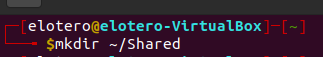
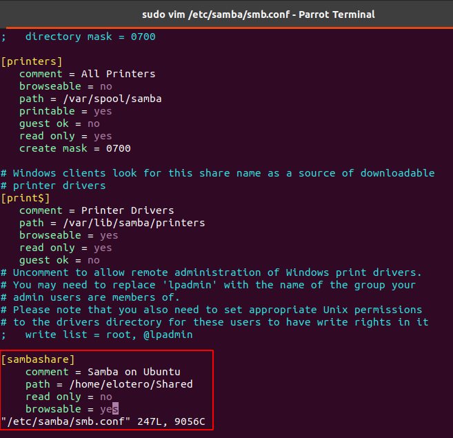
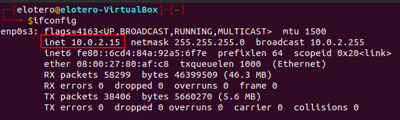
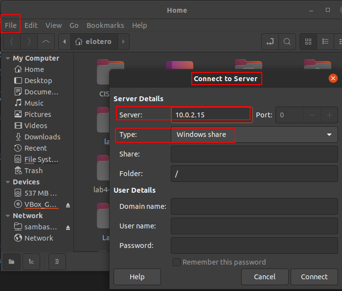
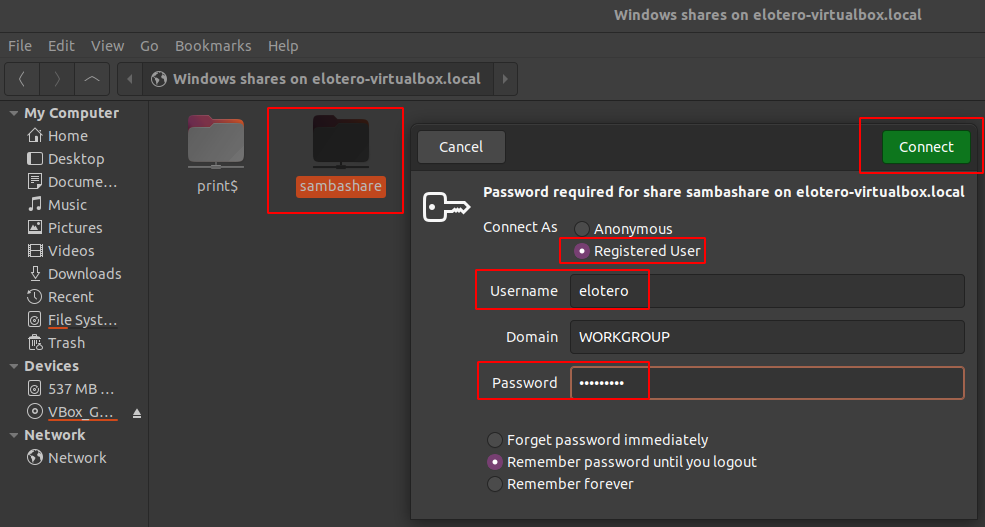

## Table of Contents
<!-- TOC -->

- [Summary and Background](#summary-and-background)
- [System Requirements](#system-requirements)
- [Installing Samba](#installing-samba)
- [Samba Set Up](#samba-set-up)
- [Set Up User Accounts](#set-up-user-accounts)
- [Connect to Server in Linux client](#connect-to-server-in-linux-client)
        - [CONGRATULATIONS! You have set up and connected to your own Samba file server!](#congratulations-you-have-set-up-and-connected-to-your-own-samba-file-server)

<!-- /TOC -->

## Summary and Background
This guide will demonstrate the installation and configuration of a Samba server on Ubuntu for file sharing within the local network. Samba is open source and free software suite providing print and file service to SMB/CIFS clients over a number of different operating systems. This case will cover access to the file server for a Linux client over LAN.

For operating a file server, the two relevant programs in the suite are:
* smbd: the server daemon that provides file sharing and printing services to Windows clients.
* nmbd: NetBIOS name service and browsing daemon.

## System Requirements
The following is required for setting up the Samba server:
* Ubuntu 16.04 LTS
* Available Local Area Network (LAN) over which to share files 

## Installing Samba
To update package index and install the latest version of Samba, use the following commands:

`sudo apt update`
`sudo apt install samba`

The latest stable version of Samba is 4.14.4. To check the version installed, we run:

`smbd --version`

## Samba Set Up
This next section will cover the relevant commands and protocols to run for setting up the Samba file server.

1. Create a shared directory for Samba to use: 

2. Add newly created directory to Samba configuration file. It can be opened with a text editor like Vim:

`sudo vim /etc/samba/smb.conf`

And add the following lines at the bottom and replace \<username> and \<sharedfile> with your local names:

    [sambashare]
        comment = Samba on Ubuntu
        path = <your shared directory path>
        read only = no
        browsable = yes

Comment describes the shared set up with Samba, path is the absolute path to your shared directory, read only grants permission to modify contents, and browsable allows the directory to be listed under "Network" in Ubuntu's default file manager.

Make sure to save before exiting!

3. Restart Samba and allow for Samba traffic under firewall rules:

`sudo service smbd restart`
`sudo ufw allow samba`

Here we are requesting restart of the service smbd, and to allow samba through the firewall.

## Set Up User Accounts

1. Set up a Samba access password for clients:

`sudo smbpasswd -a <username>`

Replace \<username> with a system account user running the server in order to save properly! You will be asked to create a password for a client to access the server.

2. Enable the client:

`sudo smbpasswd -e USER`

where USER is the name of the user account set up in the last step.

## Connect to Server in Linux client

1.  Check ip address of server by running ifconfig in Terminal:

`ifconfig`

Take note of the your ip address from above.

2. Open default file manager and enter server information from previous steps and configuration below:

#### CONGRATULATIONS! You have set up and connected to your own Samba file server!

