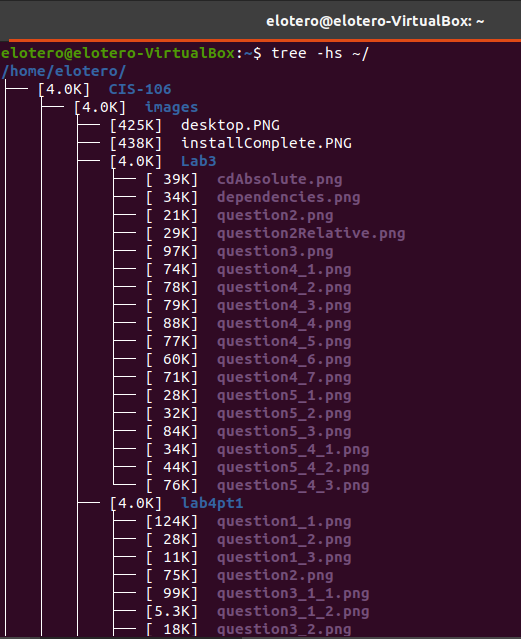

# Lab 3 | Installing software and navigating the file system | Answers
Assignment description [here](https://raw.githubusercontent.com/ra559/cis106/main/labs/lab3.md)

## Question 1
1. Which command did you use to search for the themes and to install them?
To search: sudo apt search 'theme' 
To install: sudo apt install xubuntu-artwork

2. Which commands did you use to find and install the web browser?
To search: sudo apt search 'web browser' 
To install: sudo apt install netsurf

3. Use the command line to find a 3D or 2D racing game. Answer the following questions about the game:
3.1 What is the name of the package?
xracer

3.2 What dependencies are needed in order to install the package? (you can either take a screenshot of the terminal or copy and paste from the terminal)
freeglut3 libnetpbm10 netpbm

3.3 How much disk space will the package utilize after installation?
 2,010 kB

## Question 2
Using absolute path:

Using relative path:

## Question 3

## Question 4

## Question 5
1. Long list all the files in your Downloads directory.

2. Long list all the files in your Downloads directory with a header and modified by timestamps.

3. Install the tree program. Open another terminal and use the tree --help command to list all (or most) of the options of the tree command

4. Use tree to list all the files in your home directory including the file owner and group.

5. Use tree to list all the files in your home directory including their file size and in human readable format.

