# Lab 4.2 | File Globing/wildcards

## Question 1 | Using the * Wildcard

**Problem 1:**

**Problem 2:**

**Problem 3:**
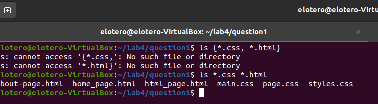

**Problem 4:**

**Problem 5:**
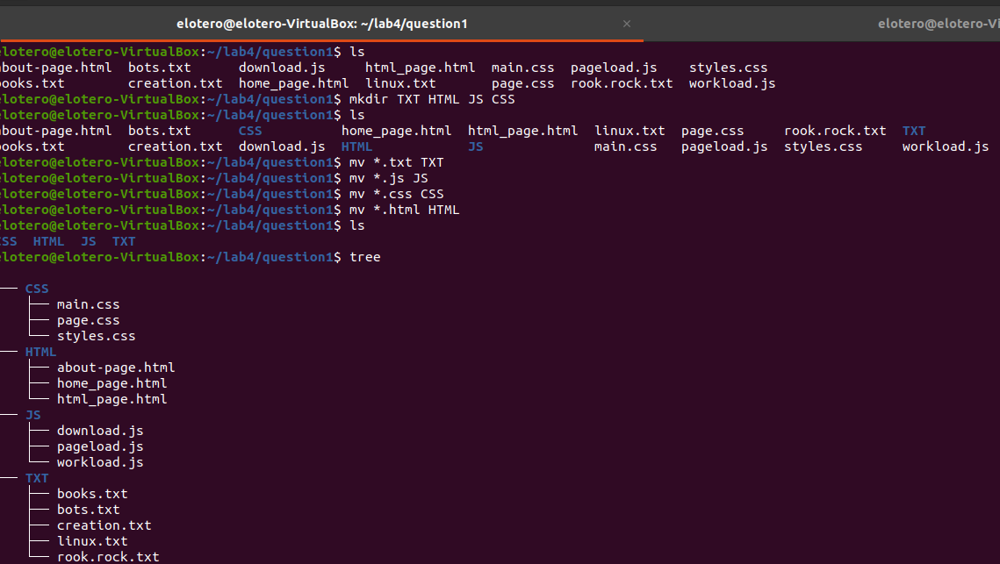

## Question 2 | Using the ? wildcard

**Problem 1:**

**Problem 2:**
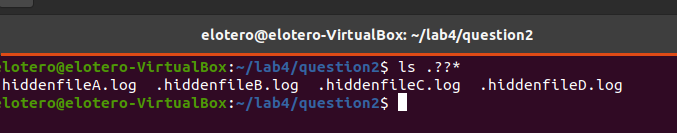

**Problem 3:**
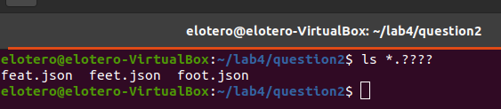

**Problem 4:**
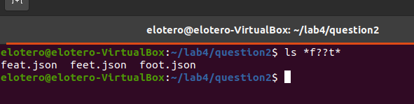

## Question 3 | Using the [] Wildcard

**Problem 1:**
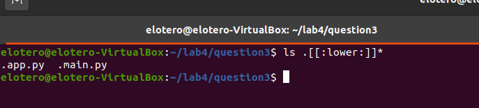

**Problem 2:**
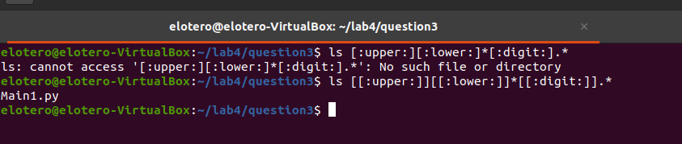

**Problem 3:**
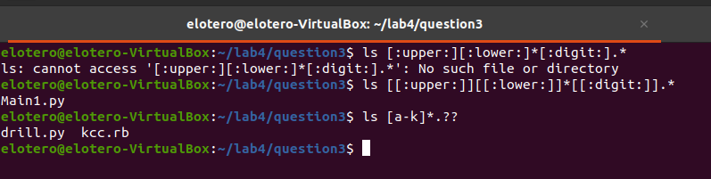

**Problem 4:**
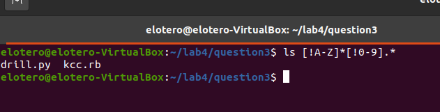

## Question 4 | Using brace expansion.

**Problem 1:**

**Problem 2:**
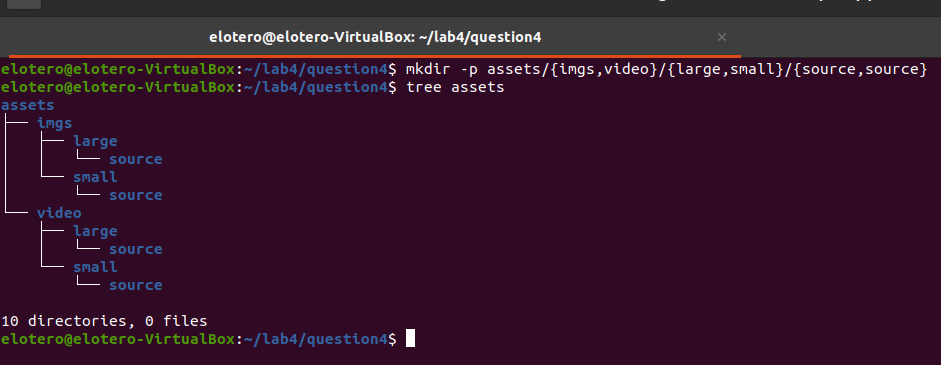

**Problem 3:**
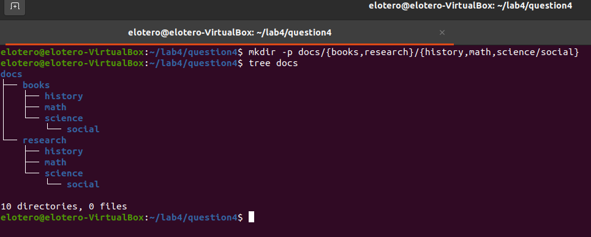

**Problem 4:**
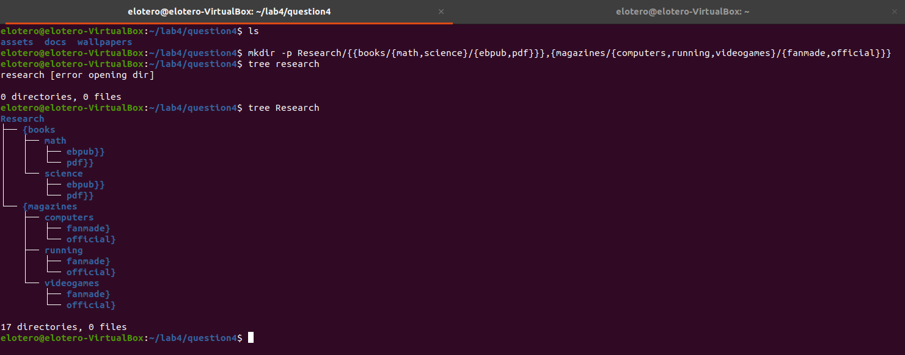

**Problem 5:**
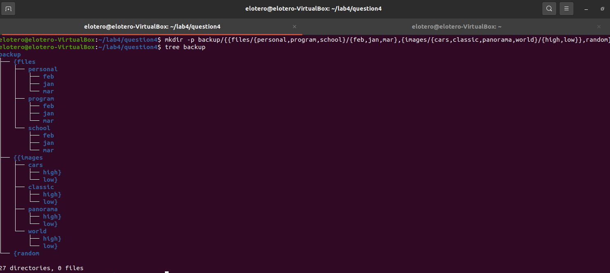