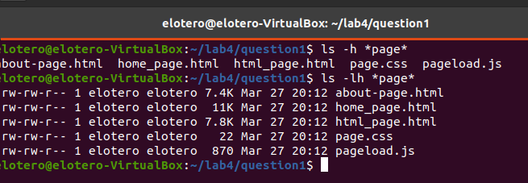
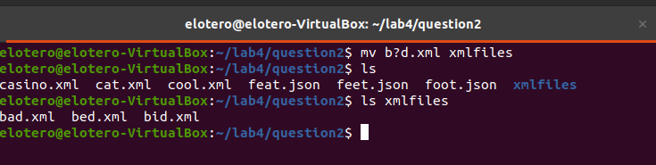
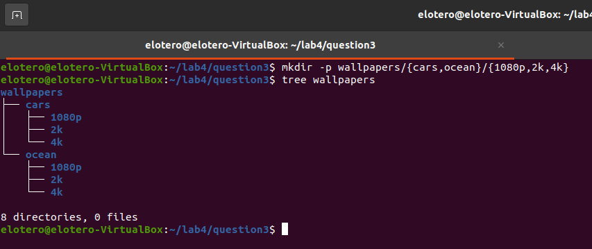

# Lab 4.2 | File Globing/wildcards

## Question 1 | Using the * Wildcard

**Problem 1:**

**Problem 2:**

**Problem 3:**

**Problem 4:**

**Problem 5:**

## Question 2 | Using the ? wildcard

**Problem 1:**

**Problem 2:**

**Problem 3:**

**Problem 4:**

## Question 3 | Using the [] Wildcard

**Problem 1:**

**Problem 2:**

**Problem 3:**

**Problem 4:**

## Question 4 | Using brace expansion.

**Problem 1:**

**Problem 2:**

**Problem 3:**

**Problem 4:**

**Problem 5:**
