# Lab 8 | File Permissions

## Question 1 | Use symbolic notation

1. Long list all the files in directory1:
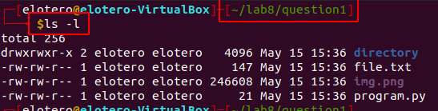

2. Modify the files permissions:
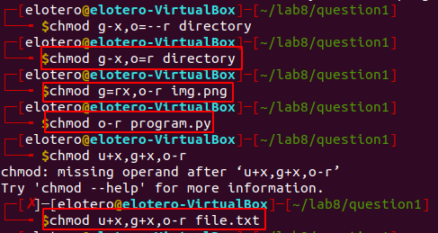

3. Long list all the files in directory1:
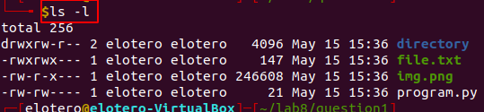

## Question 2 | Use numeric notation

1. Long list all the files in directory2:
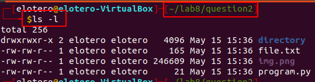

2. Modify the files permissions:
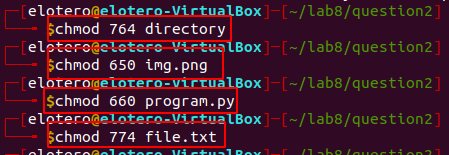

3. Long list all the files in directory2:
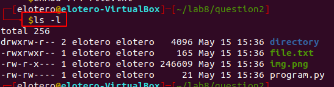

## Question 3 | Use numeric notation

1. Long list all the files in directory2:
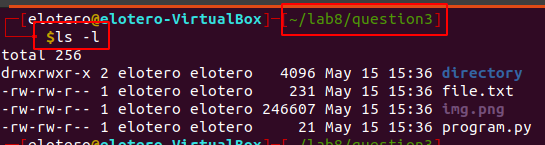

2. Modify the files permissions:
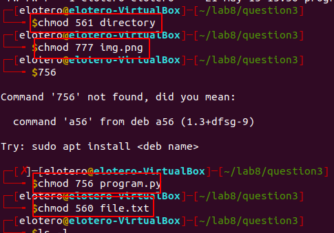

3. Long list all the files in directory2:
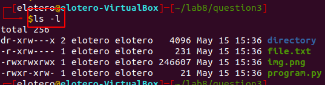

## Question 4 | Use symbolic notation

1. Long list all the files in directory2:
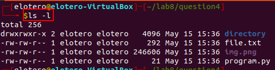

2. Modify the files permissions:
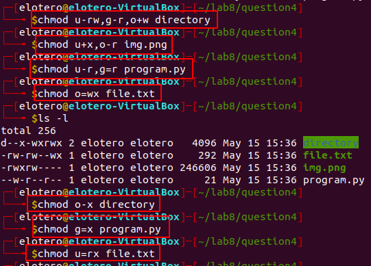

3. Long list all the files in directory2:
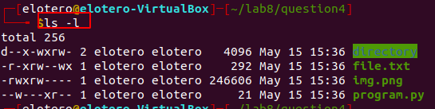